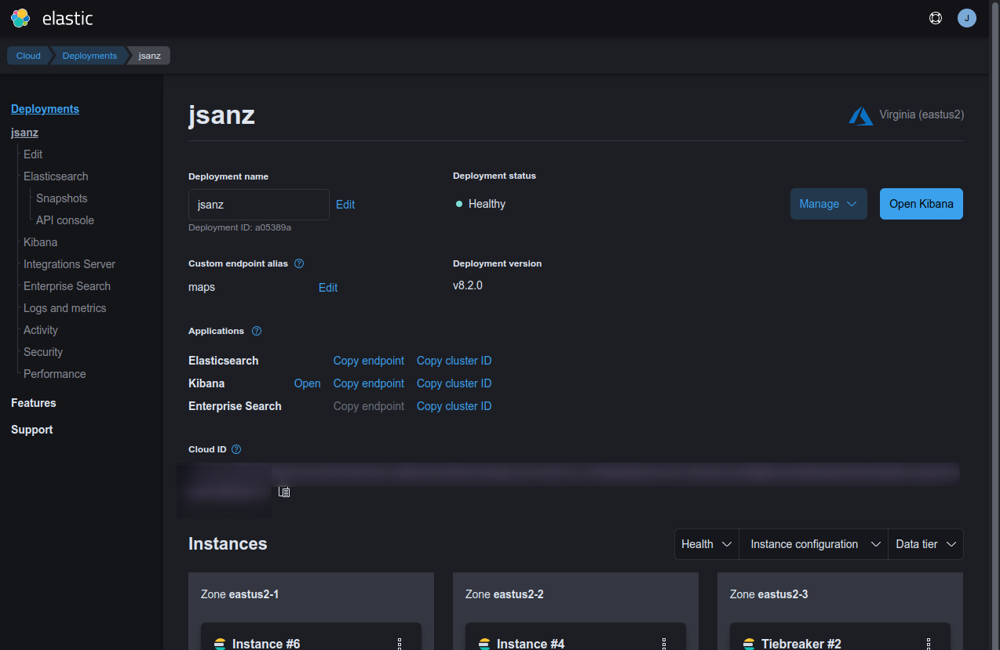

# Laboratory

## Elastic Stack set up

There are two recommended ways to set up the Elastic Stack for this laboratory:

* Create a trial account with the [Elastic Cloud][1]. This is the easiest and **recommended** procedure.
* Use [Docker](https://docs.docker.com/get-started/overview/) and [Composer](https://docs.docker.com/compose/) to start the stack locally

### Set up: Elastic Stack with [Elastic Cloud][1]

This is the easiest way to start this lab, simply create a new account at the [Elastic Cloud][1] and start a deployment. You can leave the default settings. Once you have the cluster up and running you need to save three important settings: 

* Cloud ID
* Username and password will be available to download as CSV: **do it**.

From the deployment page you can also get your endpoint URLs for Kibana and Elastic.



You have a full guide on how to set up the trial on the [Elastic Cloud Getting Started][2] page.

### Set up: Docker Compose


| ⚠ Important ⚠ |
| :-- |
| On linux systems, even running on Docker, Elasticsearch needs a memory parameter in the host system to be tuned since the default is usually too low. You can run the following command if you want it just once `sysctl -w vm.max_map_count=262144` or add `vm.max_map_count=262144` to `/etc/sysctl.conf` to make it permanent. More details in the [Virtual memory](https://www.elastic.co/guide/en/elasticsearch/reference/current/vm-max-map-count.html) section of the documentation.
 |

On the `/lab` folder you have a `docker-compose.yaml` file with the definition of all the services for this lab. It refers to a number of variables stored in the `.env` file. You may want to adapt this file but by default it should be fine.

| ⚠ Warning ⚠ |
| :-- |
| You should always set up a strong password for `elastic` and `kibana_system` users if your environment is exposed to the internet. Do not leave the defaults if your cluster is accessible to others! |

First time you run it will take some minutes since it needs to download all the images, so maybe you'll want to run `docker compose pull` and `docker compose build` from a location with good bandwidth **before** the workshop to ensure you have all the docker images installed.

To start the Elastic Stack services you can run `docker compose up -d`. This command will start two nodes of Elasticsearch, a Kibana instance, and the OpenSky loader and viewer applications.

Once running you can check their status with `docker compose ps` and `docker compose logs -f`.

If everything goes as expected you can visit kibana from `http://localhost:5601`.

## Getting [Open Sky][3] data into Elastic

Apart from having access to a Elastic Stack (both Elasticsearch and Kibana), you need data to explore them. Kibana has three well-know datasets that include geospatial information and are ready to load from the home page. For this lab we are going to load flights data in real time from the [Open Sky Network][3] using a simple nodejs script at the `opensky-loader` folder. Depending on how you access the stack the environment needs to be adapted minimally. The script can also be run in two different ways, if you have a Node development environment then you can run it locally, but if you don't have it you can use Docker Compose also to run this script.

The file `lab/elastic-config.js` is configured with some default settings, a couple of them can be overridden by environment variables.

* Elasticsearch client configuration (host and password can be set up with environment variables).
* Prefix for the name of indexes that will store the flights positions. 
* How often you want to retrieve the data from OpenSky API (every 60 seconds is more than fine)
* OpenSky optional credentials pulled from environment variables (read from the `.env` file if running from Docker).

You only need to adapt the Elasticsearch configuration, that will differs depending if you are running in Elastic Cloud, Docker Compose, or Local.

### Running the OpenSky loader and viewer applications

#### Running the Elastic stack with Docker Compose

Nothing to do, both applications started when you run `docker compose up -d`.

#### Using Docker Compose and Elastic Cloud

If you are using Elastic Cloud and docker compose you need to set up in the `.env` file the following variables:

* `ELASTIC_HOST` is the Elasticsearch endpoint. You can get this URL from Elastic cloud management UI.
* `ELASTIC_PASSWORD` is the password for the `elastic` user and you should have this stored when you created your cluster.

Now you can run just the OpenSky loader and viewer using this command:

```
docker compose -f docker-compose-opensky.yml up
```

This will start the two services defined in the [alternate compose YAML file](../lab/docker-compose-opensky.yml) pointing to your cloud instance.

#### Running locally

| 🗣 Note 🗣 |
| :-- |
| To run the script locally you need to have `node` and `npm` tools installed in your computer.|

If you prefer to run the applications directly on your computer you just need on separate terminals to go to the `opensky-loader` and `opensky-viewer` folders and run:

```sh
$ export ELASTIC_HOST="https://your-elasticsearch-endpoint:9643"
$ export ELASTIC_PASSWORD="your_elastic_user_password"
$ export OPENSKY_USER="your_opensky_user"
$ export OPENSKY_PASSWORD="your_opensky_password"
$ npm install
$ npm start
```


### Confirmation

The easiest way to check if your data is being ingested is going to the Kibana DevTools application and run this query

```
GET /flight_tracking*/_count
```

```
{
  "count" : 737482,
  "_shards" : {
    "total" : 1,
    "successful" : 1,
    "skipped" : 0,
    "failed" : 0
  }
}
```


Also, your OpenSky viewer application should render data from the `flight_tracking*` index pattern.


[1]: https://www.elastic.co/cloud/elasticsearch-service/signup
[2]: https://www.elastic.co/guide/en/cloud/current/ec-getting-started.html
[3]: https://opensky-network.org/
