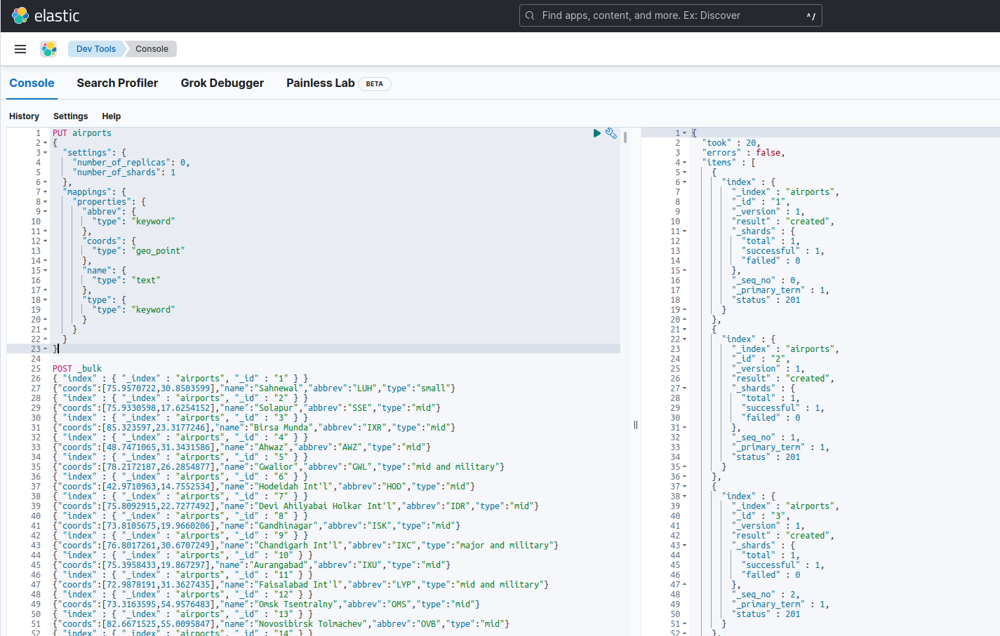

# Airports dataset

The [Natural Earth Airports dataset](https://www.naturalearthdata.com/downloads/10m-cultural-vectors/airports/) is provided here in different formats for your convenience.

* The easiest path is to upload `airports.geo.json` using Elastic Maps GeoJSON upload.
* If you want more control on the index mappings, or experiment with ingest pipelines, go to Kibana Machine Learning file uploader and select  `airports.csv` and `airports.ldjson`
* To upload using Kibana Dev Tools: `airports.bulk`

## Using dev tools:

Create the index:

```
PUT airports
{
  "settings": {
    "number_of_replicas": 0,
    "number_of_shards": 1
  },
  "mappings": {
    "properties": {
      "abbrev": {
        "type": "keyword"
      },
      "coords": {
        "type": "geo_point"
      },
      "name": {
        "type": "text"
      },
      "type": {
        "type": "keyword"
      }
    }
  }
}
```

Send the contents of the `airports.bulk` file using the `POST _bulk` query.


